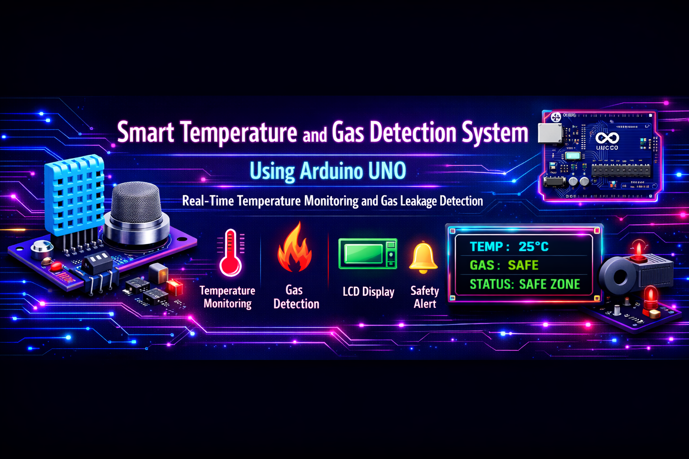
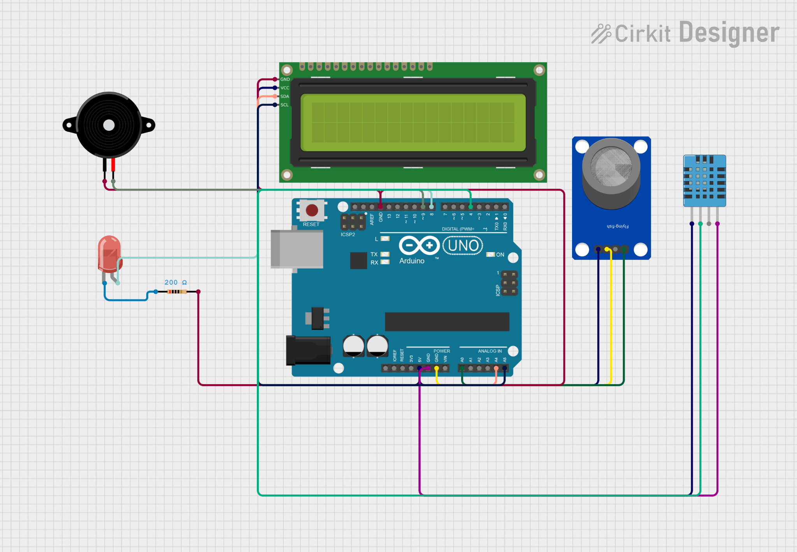

<p align="center">

</p>

<h1 align="center">
Smart Temperature and Gas Detection System Using Arduino UNO
</h1>

<p align="center">
An Arduino UNO based safety monitoring system for real-time temperature monitoring and gas leakage detection.
</p>

---

# Overview

The Smart Temperature and Gas Detection System is an embedded safety monitoring project developed using the **Arduino UNO** microcontroller.

The system continuously monitors surrounding temperature and detects combustible gas leakage using a **DHT11 Temperature and Humidity Sensor** and an **MQ Gas Sensor**.

Whenever the measured temperature exceeds **28°C** or the gas sensor value exceeds **400**, the Arduino activates an LED and buzzer while displaying an appropriate warning message on a **16×2 I2C LCD display**.

The system provides four operating states:

* Safe Zone
* Temperature Warning
* Gas Warning
* Danger

This project is designed as a low-cost, reliable, and easy-to-implement safety monitoring solution suitable for homes, laboratories, and educational applications.

---

# Features

* Real-time Temperature Monitoring
* Real-time Gas Leakage Detection
* Temperature and Humidity Monitoring
* 16×2 I2C LCD Display
* LED Alert System
* Active Buzzer Alert
* Four Operating Modes
* Arduino UNO Based Embedded System
* Low-Cost Hardware Design
* Easy Installation and Maintenance

---

# Hardware Components

| Component            | Purpose                              |
| -------------------- | ------------------------------------ |
| Arduino UNO          | Main processing controller           |
| DHT11 Sensor         | Temperature and humidity measurement |
| MQ Gas Sensor        | Gas leakage detection                |
| 16×2 I2C LCD Display | Status display                       |
| LED                  | Warning indication                   |
| Active Buzzer        | Audio alert                          |
| Breadboard           | Circuit connection                   |
| Jumper Wires         | Hardware connections                 |
| USB Cable            | Programming and power supply         |

---

# Software Used

* Arduino IDE
* Embedded C
* Cirkit Designer

---

# Circuit Diagram

The complete circuit was designed and verified using **Cirkit Designer** before hardware implementation.

<p align="center">

</p>

---

# Circuit Design

The circuit was designed and verified using Cirkit Designer.

**Project Link:**

https://app.cirkitdesigner.com/project/00073028-c51b-4fdc-a3f5-2e0000e93342

---

# Hardware Setup

The hardware prototype consists of an Arduino UNO, DHT11 Temperature and Humidity Sensor, MQ Gas Sensor, 16×2 I2C LCD Display, LED, Active Buzzer, Breadboard, and Jumper Wires.

<p align="center">

</p>

---

# System Output

## Safe Zone

Under normal environmental conditions, the LCD displays **SAFE ZONE** and both LED and buzzer remain OFF.

<p align="center">

</p>

---

## Temperature Warning

When the measured temperature exceeds **28°C**, the LCD displays **TEMP WARNING** and the LED and buzzer are activated automatically.

<p align="center">

</p>

---

## Gas Warning

When the MQ Gas Sensor detects combustible gas above the threshold value of **400**, the LCD displays **GAS WARNING** and the LED and buzzer are activated.

<p align="center">

</p>

---

## Danger Mode

When both temperature and gas levels exceed the predefined threshold values simultaneously, the LCD displays **DANGER** and both LED and buzzer remain ON.

<p align="center">

</p>

---

# Working Principle

1. Arduino UNO reads temperature and humidity values from the DHT11 sensor.
2. MQ Gas Sensor continuously measures gas concentration.
3. Arduino compares sensor values with predefined threshold values.
4. If values are within limits, LCD displays **SAFE ZONE**.
5. If temperature exceeds **28°C**, **TEMP WARNING** is displayed.
6. If gas value exceeds **400**, **GAS WARNING** is displayed.
7. If both conditions exceed limits, **DANGER MODE** is activated.
8. LED and buzzer provide immediate warning indication.

---

# Pin Configuration

| Component     | Arduino Pin |
| ------------- | ----------- |
| DHT11 Data    | D4          |
| MQ Gas Sensor | A0          |
| LED           | D8          |
| Buzzer        | D9          |
| LCD SDA       | A4          |
| LCD SCL       | A5          |

---

# Threshold Values

| Parameter   | Threshold |
| ----------- | --------- |
| Temperature | 28°C      |
| Gas Sensor  | 400       |

---

# Project Structure

```text
Smart-Temperature-Gas-Detection-System
│
├── Arduino_Code
│   └── Smart_Temperature_Gas_Detection.ino
│
├── Circuit
│   └── Circuit_Diagram.png
│
├── Documentation
│   └── Project_Report.pdf
│
├── Images
│   ├── Project_Banner.png
│   ├── Hardware_Setup.png
│   ├── Safe_Zone.png
│   ├── Temperature_Warning.png
│   ├── Gas_Warning.png
│   └── Danger_Mode.png
│
├── Presentation
│   └── Smart_Temperature_Gas_Detection_Presentation.pptx
│
├── README.md
│
└── LICENSE
```

---

# Source Code

The complete Arduino source code is available in:

```text
Arduino_Code/
└── Smart_Temperature_Gas_Detection.ino
```

---

# Documentation

The complete project report is available in the **Documentation** folder.

File:

```text
Project_Report.pdf
```

---

# Project Presentation

The complete PowerPoint presentation is available in the **Presentation** folder.

File:

```text
Smart_Temperature_Gas_Detection_Presentation.pptx
```

---

# Applications

* Home Safety Monitoring
* Kitchen Gas Leakage Detection
* Laboratory Safety Systems
* Small-Scale Industries
* Educational Embedded Projects
* Environmental Monitoring

---

# Future Enhancements

* IoT Integration
* GSM SMS Alerts
* Wi-Fi Monitoring
* Mobile Application
* Cloud Data Logging
* Automatic Exhaust Fan Control
* Automatic Gas Valve Shut-Off
* AI-Based Hazard Prediction

---

# Author

**Karthikeyan M**

Department of Electrical and Electronics Engineering

V.S.B College of Engineering Technical Campus

Anna University

Academic Year: **2023–2027**

---

# License

This project is licensed under the **MIT License**.

You are free to use, modify, and distribute this project for educational and research purposes with proper credit to the original author.
