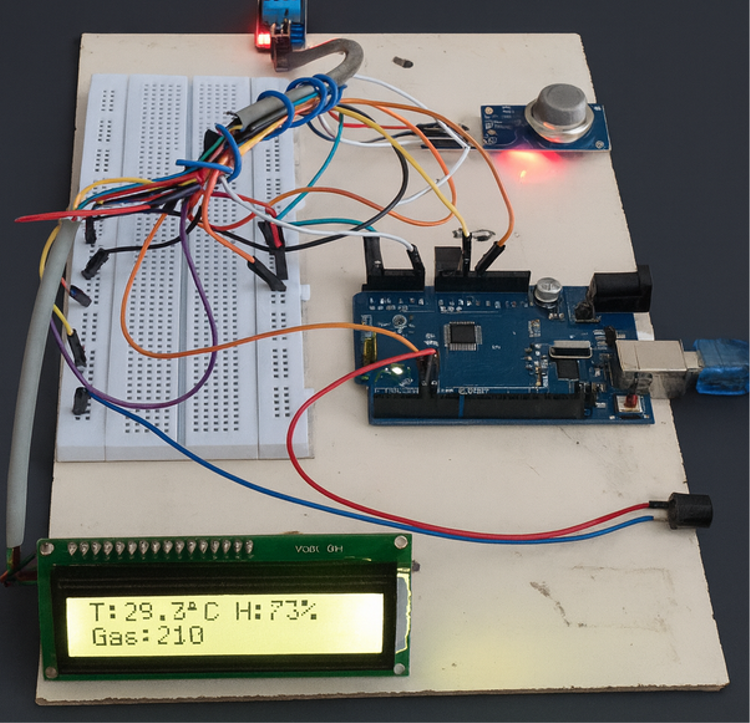
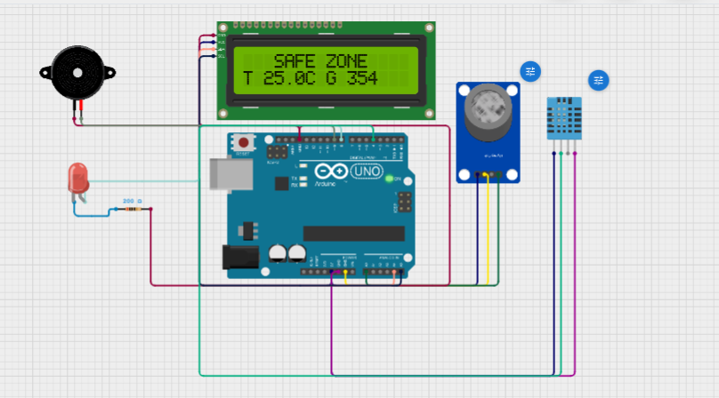
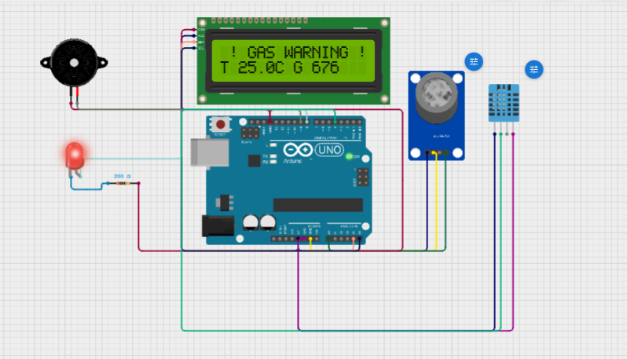
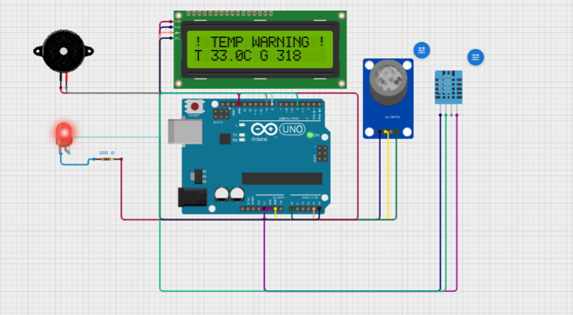
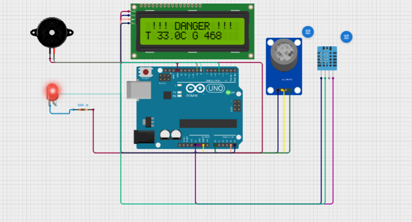

# 🔥 Smart Temperature and Gas Detection System

An Arduino UNO based embedded system designed to detect abnormal temperature and harmful gas leakage using the DHT11 and MQ Gas Sensor. The system provides instant visual and audible alerts through an LCD display, LED, and buzzer to improve safety in indoor environments.

---

## 📌 Project Overview

The Smart Temperature and Gas Detection System continuously monitors the surrounding environment by measuring temperature, humidity, and gas concentration. Whenever the sensed values exceed predefined safety thresholds, the system immediately activates the LED and buzzer while displaying an appropriate warning message on the LCD.

This project demonstrates the implementation of a simple embedded safety monitoring system using Arduino UNO.

---

## 🎯 Objectives

- Monitor surrounding temperature and humidity.
- Detect harmful gas leakage.
- Display real-time sensor values.
- Provide immediate warning using LED and buzzer.
- Improve safety through continuous monitoring.

---

## 🛠️ Hardware Components

- Arduino UNO
- DHT11 Temperature and Humidity Sensor
- MQ Gas Sensor
- 16×2 I2C LCD Display
- LED
- Active Buzzer
- Breadboard
- Jumper Wires
- USB Cable

---

## 💻 Software Used

- Arduino IDE
- Cirkit Designer
- GitHub

---

## ⚙️ Working Principle

1. The DHT11 sensor measures temperature and humidity.
2. The MQ Gas Sensor measures the gas concentration.
3. Arduino continuously reads both sensor values.
4. The measured values are compared with predefined threshold values.
5. If temperature exceeds **28°C**, a **Temperature Warning** is displayed.
6. If gas value exceeds **400**, a **Gas Warning** is displayed.
7. If both exceed their thresholds, a **Danger** warning is displayed.
8. During warning conditions, the LED and buzzer are activated.
9. Under normal conditions, the LCD displays **SAFE ZONE** along with the current sensor readings.

---

## 🚨 Threshold Values

| Parameter | Threshold |
|-----------|----------:|
| Temperature | 28°C |
| Gas Sensor | 400 |

---

## 📟 LCD Display Status

| Condition | LCD Message |
|-----------|-------------|
| Normal | SAFE ZONE |
| High Temperature | TEMP WARNING |
| High Gas | GAS WARNING |
| High Temperature + High Gas | DANGER |
| Sensor Error | SENSOR ERROR |

---

## 🔗 Circuit Design

The complete circuit was designed using **Cirkit Designer**.

https://app.cirkitdesigner.com/project/00073028-c51b-4fdc-a3f5-2e0000e93342

---

## 📷 Project Images

### Hardware Setup



---

### Safe Zone



---

### Gas Warning



---

### Temperature Warning



---

### Danger Mode



---

## 📁 Repository Structure

```
Smart-Temperature-Gas-Detection-System
│
├── Arduino_Code
│   └── Smart_Temperature_Gas_Detection.ino
│
├── Circuit
│   └── Circuit_Diagram.png
│
├── Documentation
│   └── Project_Report.pdf
│
├── Images
│   ├── Hardware_Setup.png
│   ├── Safe_Zone.png
│   ├── Gas_Warning.png
│   ├── Temperature_Warning.png
│   └── Danger_Mode.png
│
├── README.md
└── LICENSE
```

---

## 🚀 Future Improvements

- ESP32 IoT Integration
- ThingSpeak Cloud Monitoring
- Mobile Notification System
- Wi-Fi Based Remote Monitoring
- Automatic Exhaust Fan Control

---

## 👨‍💻 Author

**Karthikeyan M**

Electronics and Electronics Engineering Student

---

## 📄 License

This project is licensed under the **MIT License**.

---

### ⭐ If you found this project useful, consider giving this repository a Star.
